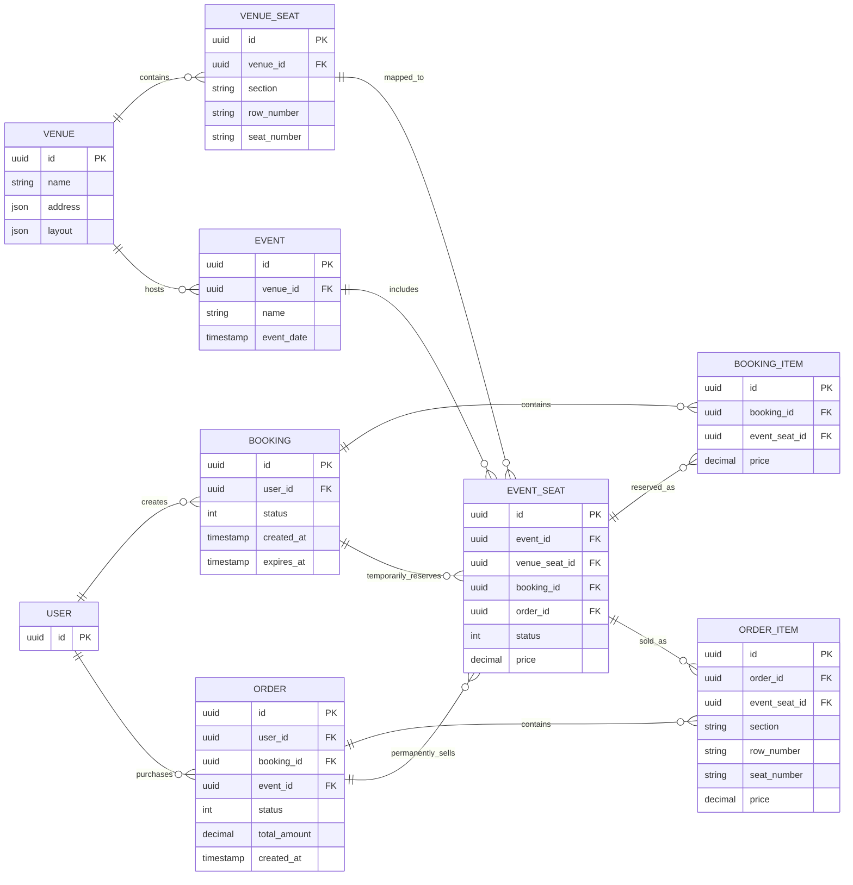
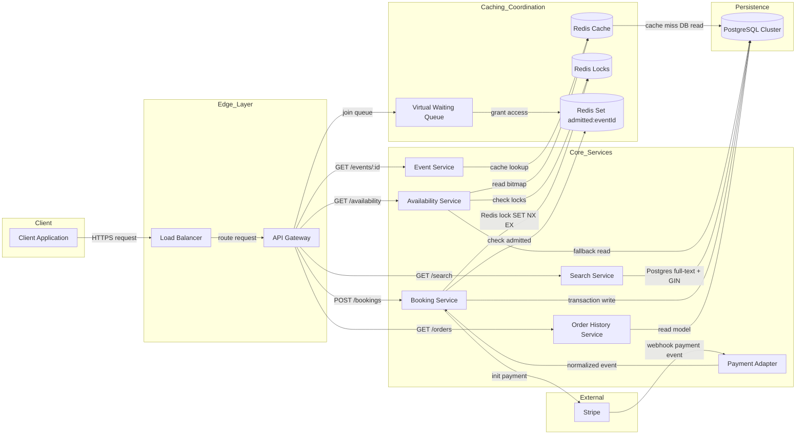
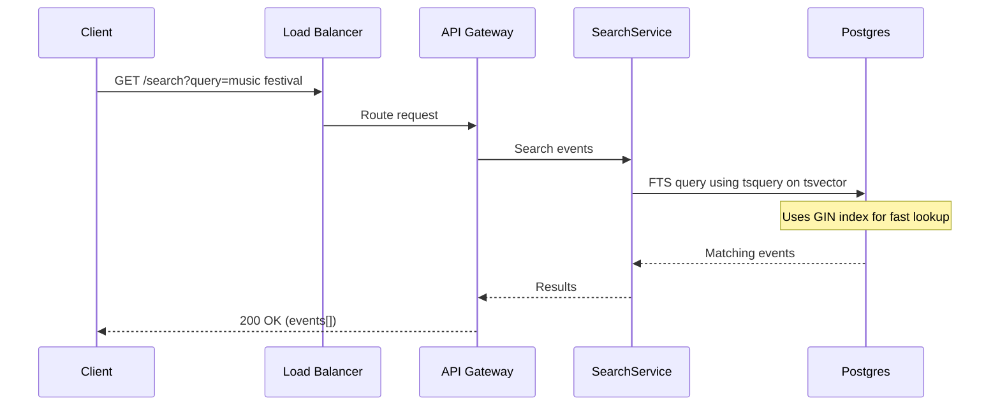
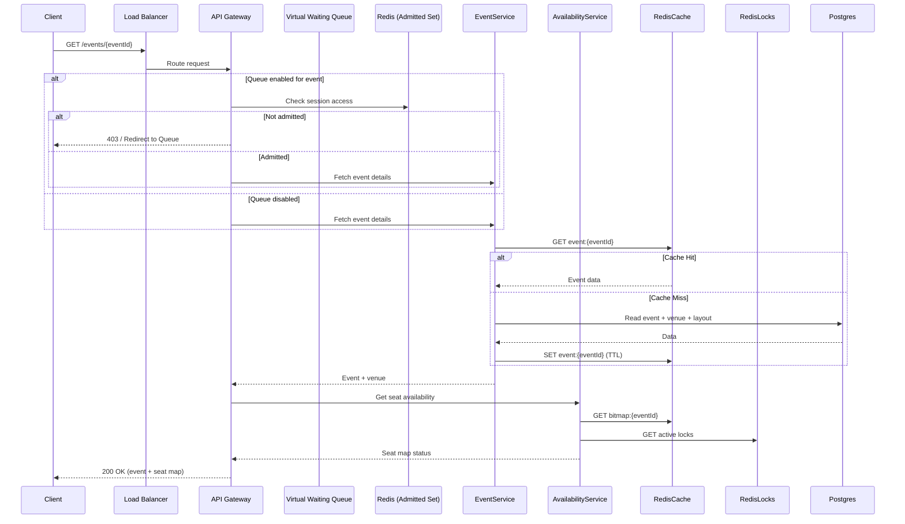
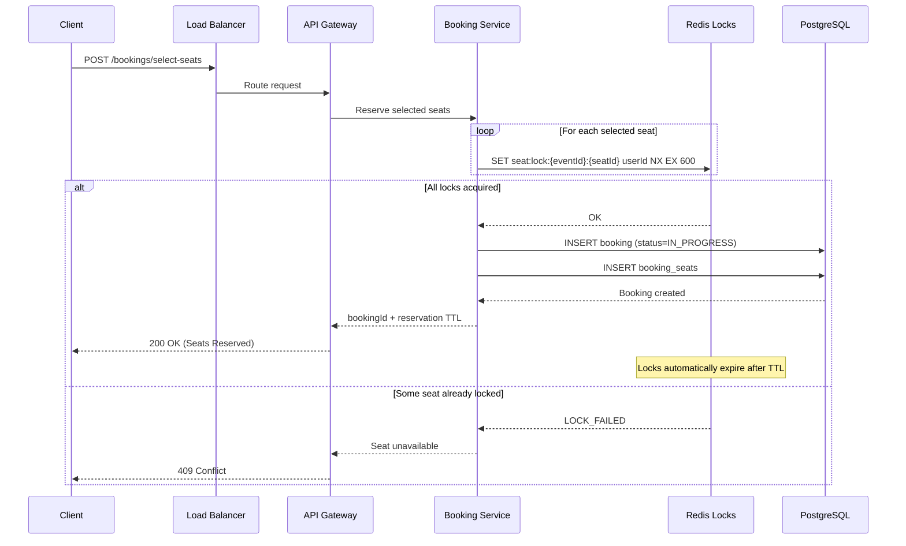
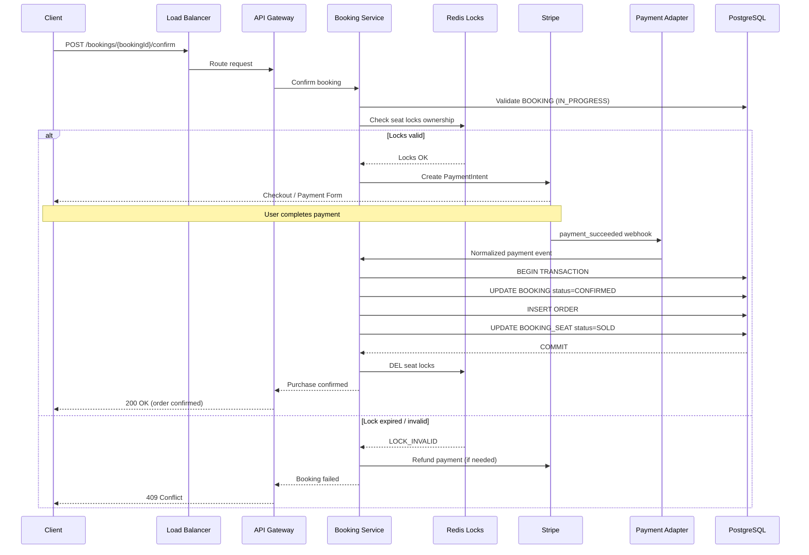
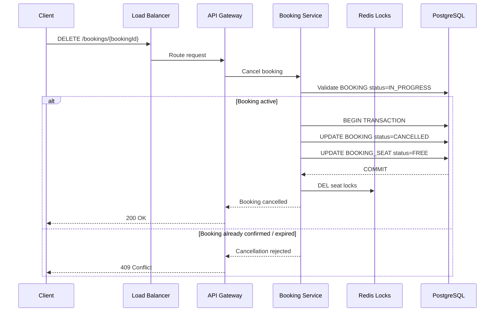
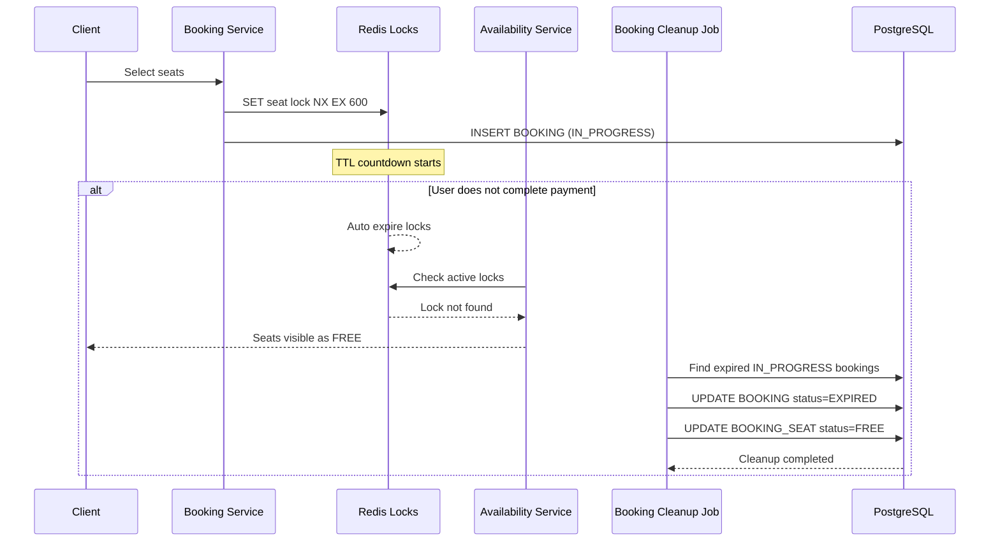
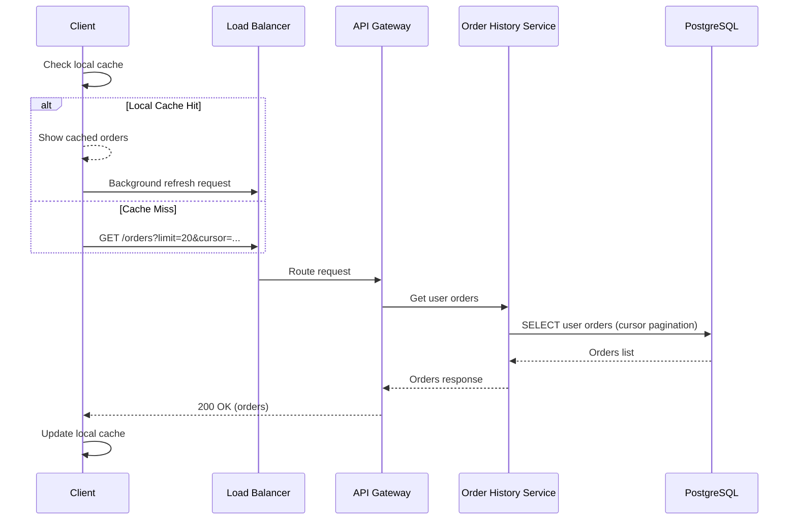
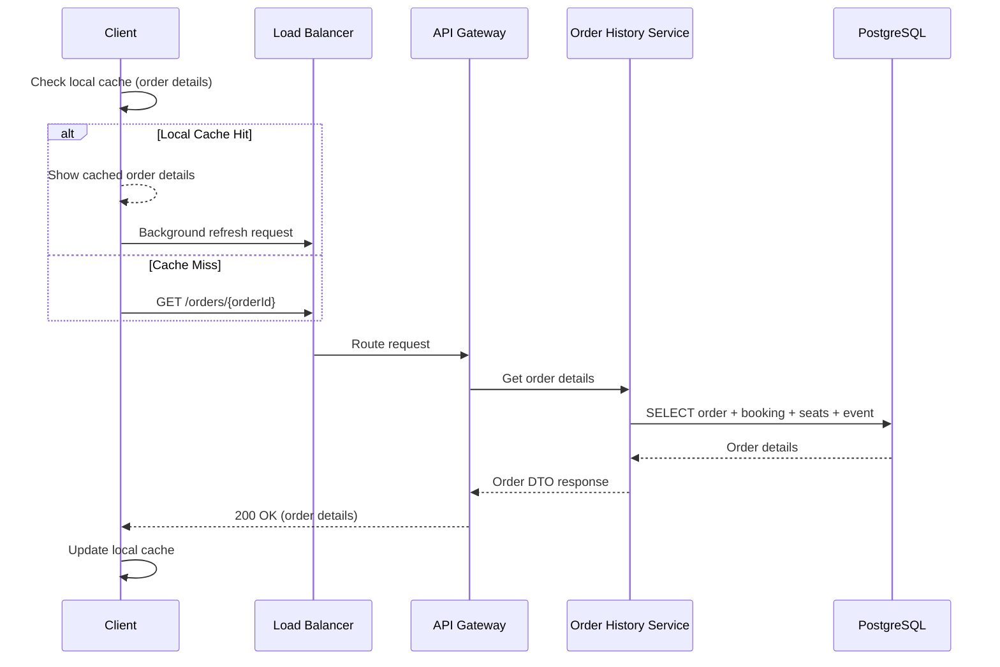

# Техническое решение проекта «Сервис бронирования билетов»

## Введение
Необходимо спроектировать сервис бронирования билетов на мероприятия, который позволяет пользователю выбрать событие, посмотреть доступные места, забронировать билеты и подтвердить покупку.
Система должна поддерживать базовый сценарий:
- пользователь выбирает мероприятие;
- система показывает доступные места;
- пользователь выбирает одно или несколько мест;
- система временно резервирует выбранные места;
- пользователь подтверждает покупку;
- билеты переходят в состояние проданных либо бронь снимается по таймауту или отмене.

Цель проекта — предложить архитектуру highload-системы, способной корректно работать при высокой конкуренции за ограниченный ресурс, предотвращать двойную продажу одного и того же места и выдерживать всплески нагрузки в момент старта продаж.
 

---

## Глоссарий
| Термин | Определение |
|--------|------------|
| Событие | Концерт, спектакль, матч или другое мероприятие, на которое продаются билеты. |
| Площадка (Venue) | Физическое место проведения события с определённой схемой зала и набором мест. |
| Место | Конкретная позиция в зале, доступная для бронирования в рамках события. |
| Статус места | Состояние места: свободно, временно забронировано (reserved), продано. |
| Бронь (Booking) | Временное резервирование одного или нескольких мест за пользователем до оплаты. |
| Позиция брони | Элемент брони, связанный с конкретным местом события (booking item). |
| Заказ (Order) | Подтверждённая покупка после успешной оплаты, фиксирующая факт продажи билетов. |
| Элемент заказа | Детализация заказа по конкретным местам, включая snapshot данных на момент покупки. |
| Таймаут брони | Ограниченное время удержания мест за пользователем до автоматического освобождения. |
| Virtual Waiting Queue | Механизм управления доступом пользователей к системе при пиковых нагрузках (admin-enabled режим). |
| Oversell | Ситуация, при которой одно и то же место продаётся более одного раза. |

---

## Функциональные требования
Система должна предоставлять следующие функции:

1. Просмотр мероприятий
    - Система должна позволять пользователю:
        - просматривать список доступных мероприятий;
        - получать информацию о выбранном мероприятии;
        - видеть схему зала или список мест;
        - видеть текущую доступность мест.

    - Для каждого мероприятия должны быть доступны как минимум:
        - event_id;
        - название;
        - дата и время;
        - место проведения;
        - схема площадки или список мест.

2. Выбор мест
    - Система должна позволять пользователю:
        - выбрать одно или несколько мест;
        - получить информацию о цене выбранных мест;
        - начать процесс бронирования.

3. Временное резервирование мест
    - Система должна:
        - временно резервировать выбранные места за пользователем;
        - назначать время жизни брони;
        - запрещать одновременное успешное резервирование одного и того же места несколькими пользователями;
        - автоматически освобождать места после истечения таймаута, если покупка не была завершена.

4. Подтверждение покупки
    - Система должна позволять пользователю:
        - подтвердить покупку забронированных мест;
        - получить результат операции;
        - после успешного подтверждения перевести места в состояние sold.

5. Отмена брони
    - Система должна поддерживать снятие брони:
        - по явной отмене со стороны пользователя;
        - по истечении таймаута;
        - при неуспешном завершении покупки.

6. История заказов
    - Система должна позволять пользователю:
        - просматривать список своих заказов;
        - видеть статус заказа;
        - получать базовую информацию о мероприятии, местах и стоимости.

---

## Нефункциональные требования
1. Нагрузка
    - Система должна выдерживать:
        - до 1 000 операций бронирования в секунду в пике;
        - до 10 000 запросов в секунду на чтение доступности мест в момент старта продаж.
    - Основной характер нагрузки:
        - чтение доступности мест;
        - короткие конкурентные операции резервирования;
        - резкие всплески нагрузки на популярных событиях.
2. Производительность
    - Требования к производительности:
        - получение списка мест и их доступности — P95 не более 200 мс;
        - создание временной брони — P95 не более 300 мс;
        - подтверждение покупки — P95 не более 500 мс.
3. Надёжность
    - Система должна обеспечивать:
        - отсутствие потери подтверждённых покупок;
        - корректную работу при повторной отправке запросов;
        - устойчивость к сбоям отдельных экземпляров сервисов;
        - автоматическое освобождение “зависших” броней.
4. Консистентность
    - Для критичных операций требуется согласованность:
        - одно место не может быть одновременно успешно забронировано несколькими пользователями;
        - проданное место не может снова стать доступным без отдельной явной операции возврата;
        - подтверждённая покупка не должна приводить к oversell.
    - Для истории заказов допускается eventual consistency.
5. Масштабируемость
    - Система должна горизонтально масштабироваться по следующим контурам:
        - чтение каталога мероприятий;
        - чтение доступности мест;
        - операции бронирования;
        - хранение истории заказов.
---

## Пользовательские сценарии

### Сценарий: просмотр списка мероприятий

1. Пользователь запрашивает список доступных мероприятий. При необходимости пользователь применяет фильтры.
2. Система возвращает отфильтрованный список мероприятий с базовой информацией.

### Сценарий: просмотр деталей мероприятия и схемы зала

1. Пользователь выбирает конкретное мероприятие из списка.
2. Система показывает детальную информацию, включая схему зала с отображением статусов мест.

### Сценарий: выбор свободных мест для бронирования

1. Пользователь на схеме зала выбирает одно или несколько свободных мест для бронирования, и нажимает кнопку "Забронировать"
2. Система проверяет, что все места ещё свободны и не находятся в активной броне у другого пользователя.
3. Система переводит места в статус «забронировано» и назначает время жизни брони.

### Сценарий: подтверждение покупки

1. Пользователь с активной бронью нажимает «Подтвердить покупку».
2. Клиентское приложение отправляет запрос на подтверждение с `booking_id` и платёжными данными.
3. Система проверяет, что бронь активна.
4. Система переводит места из статуса "забронировано" в статус "продано" и создаёт заказ с информацией о мероприятии и местах.
5. Система отправляет пользователю подтверждение с деталями заказа.

### Сценарий: отмена брони пользователем до оплаты

1. Пользователь нажимает кнопку «Отменить бронь» в интерфейсе активной брони.
2. Система проверяет, что бронь существует и принадлежит этому пользователю.
3. Система переводит места из статуса "забронировано" обратно в статус "свободно".
4. Пользователь видит подтверждение, того что бронь отменена.

### Сценарий: автоматическое снятие брони по таймауту

1. Пользователь зарезервировал места, но не подтвердил покупку в течение заданного времени.
2. Для истёкшей брони система переводит связанные места из статуса из статуса "забронировано" обратно в статус "свободно".
4. Освобождённые места снова становятся видны другим пользователям как доступные.
5. Пользователь при попытке оплатить после таймаута получает ошибку: «Время брони истекло. Пожалуйста, выберите места заново».

### Сценарий: просмотр истории заказов пользователя

1. Пользователь запрашивает историю заказов.
3. Система возвращает список заказов пользователя с краткой информацией по каждому.

### Сценарий: просмотр деталей конкретного заказа

1. Пользователь в истории заказов выбирает конкретный заказ.
2. Система возвращает полную информацию о заказе.

---

## API Методы

### Мероприятия

| Метод | Эндпоинт | Описание |
|-------|----------|----------|
| GET | `/events` | Список доступных мероприятий (с фильтрацией) |
| GET | `/events/{event_id}` | Детальная информация о мероприятии, включая схему мест |

### Бронирование

| Метод | Эндпоинт | Описание |
|-------|----------|----------|
| POST | `/bookings` | Создать временную бронь выбранных мест |
| POST | `/bookings/{booking_id}/deny` | Отменить бронь |
| POST | `/bookings/{booking_id}/confirm` | Подтвердить покупку и завершить заказ |

### Заказы

| Метод | Эндпоинт | Описание |
|-------|----------|----------|
| GET | `/orders` | История заказов пользователя |
| GET | `/orders/{order_id}` | Детальная информация о заказе |

---

## Модель данных (Data Model)

В основе сервиса бронирования лежит управление состояниями мест и заказов. Ключевое требование — предотвращение double-booking (oversell) при высоком конкурентном доступе. Для этого используется комбинация реляционной БД (PostgreSQL) для гарантий ACID и Redis для распределённых блокировок с автоматическим TTL и кэширования доступности мест.

### Основные сущности (Схема БД)

### Описание сущностей

1. **`EVENT`**: Хранит информацию о мероприятии (название, дата и время проведения, площадка). Используется в сценариях просмотра каталога мероприятий, получения информации о событии и отображения схемы мест.

2. **`VENUE`**: Содержит информацию о площадке проведения мероприятия (название, адрес). Определяет физическую структуру зала, в рамках которой создаются места (`VENUE_SEAT`).

3. **`VENUE_SEAT`**: Представляет физическое место на площадке. Содержит сектор, ряд и номер места. Используется как шаблон для создания мест конкретного мероприятия (`EVENT_SEAT`).

4. **`EVENT_SEAT`**: Представляет конкретное место на конкретном мероприятии. Является основной сущностью для контроля доступности мест. Содержит статус (`free`, `sold`), цену, ссылки на бронь и заказ.

5. **`BOOKING`**: Фиксирует временное резервирование мест за пользователем. Содержит статус (`active`, `expired`, `cancelled`, `confirmed`), время создания и время истечения брони. Создаётся при выборе мест и завершается подтверждением покупки либо отменой.

6. **`BOOKING_ITEM`**: Связывает бронь с конкретными местами мероприятия (`EVENT_SEAT`). Позволяет одной брони содержать несколько мест. Хранит цену на момент резервирования.

7. **`ORDER`**: Создаётся после успешного подтверждения покупки. Представляет подтверждённый заказ пользователя и используется для хранения истории покупок. Содержит итоговую сумму, статус заказа и время оформления.

8. **`ORDER_ITEM`**: Связывает заказ с конкретными купленными местами. Хранит snapshot данных места (сектор, ряд, номер, цена) на момент покупки.

9. **`USER`**: Хранит идентификатор пользователя системы. Используется для привязки броней, заказов и получения истории покупок пользователя.

---

# Архитектура системы

Архитектура построена на микросервисной модели с использованием Redis для кэширования, распределённых блокировок и управления доступом в периоды высокой нагрузки. Основной фокус системы — поддержка 10 000 RPS на чтение доступности мест и до 1 000 операций бронирования в секунду при пиковых нагрузках.

## Основные компоненты

1. **Load Balancer** — входная точка системы, распределяет трафик между API Gateway инстансами, обеспечивает отказоустойчивость и базовую защиту от перегрузок.

2. **API Gateway** — единая точка входа для клиентов, отвечает за аутентификацию, rate limiting и маршрутизацию запросов к внутренним сервисам. Также участвует в проверке доступа пользователей при использовании Virtual Waiting Queue.

3. **Event Service** — сервис чтения данных о мероприятиях, возвращает информацию о событиях, venue и схеме зала. Использует Redis Cache для ускорения ответов и PostgreSQL как основной источник истины.

4. **Availability Service** — высоконагруженный read-сервис, отвечающий за отображение доступности мест и формирование схемы зала. Объединяет данные из PostgreSQL и Redis (включая временные блокировки).

5. **Search Service** — сервис поиска мероприятий, использующий PostgreSQL Full-Text Search на основе GIN индексов и tsvector.

6. **Booking Service** — основной сервис бронирования, отвечающий за управление временными резервированиями через Redis (SET NX EX), создание бронирований, транзакционные операции в PostgreSQL и финализацию заказов.

7. **Payment Adapter** — интеграционный слой для работы с платёжным провайдером (например, Stripe), обрабатывает вебхуки и передаёт события в Booking Service для завершения транзакций.

8. **Order History Service** — сервис для получения истории заказов пользователя, построенный по CQRS-подходу и работающий поверх PostgreSQL read-модели.

9. **PostgreSQL Cluster** — основное хранилище системы (source of truth), обеспечивает ACID-гарантии и предотвращение oversell через транзакции и механизмы блокировок.

10. **Redis Cluster** — используется для распределённых блокировок (seat reservations), кэширования часто запрашиваемых данных и хранения состояния виртуальной очереди (admitted users).

## Архитектурная схема

### Паттерны и подходы

#### Распределённая блокировка Redis (SET NX EX)

Для временного резервирования мест и уменьшения конкурентных конфликтов используется паттерн **распределённой блокировки** на основе Redis. `Booking Service` при выборе мест выполняет атомарную команду `SET seat:lock:{event_id}:{seat_id} user_id NX EX ttl`, где `NX` позволяет установить ключ только при его отсутствии, а `EX` задаёт TTL блокировки (например, 600 секунд). Это гарантирует, что только один пользователь может временно зарезервировать место в каждый момент времени. Redis используется как механизм краткоживущих блокировок и автоматического освобождения мест по таймауту, тогда как PostgreSQL остаётся основным источником истины и гарантирует отсутствие oversell через транзакции и механизмы блокировок.

#### Кэширование

Для снижения нагрузки на базу данных и ускорения ответа API используется **кэширование часто запрашиваемых и редко изменяемых данных**. В Redis помещаются данные о мероприятиях, площадках и схемах залов. При запросе сначала выполняется чтение из кэша, и только при cache miss происходит обращение к PostgreSQL с последующим обновлением кэша. Для поддержания актуальности используются TTL и/или механизмы инвалидации при изменении данных в базе. Это позволяет существенно снизить нагрузку на БД и уменьшить latency для read-heavy сценариев.

#### Load Balancing

Для равномерного распределения входящего трафика используется **балансировка нагрузки**. Все клиентские запросы проходят через load balancer, который распределяет их между экземплярами API Gateway и микросервисов с использованием алгоритма Round Robin. Это позволяет избежать перегрузки отдельных инстансов, повысить устойчивость системы и обеспечить стабильную работу при пиковых нагрузках, особенно во время старта продаж популярных мероприятий.

#### Horizontal Scaling

Для обработки высокой нагрузки сервисы проектируются как **stateless компоненты**, что позволяет масштабировать их горизонтально путём добавления новых экземпляров. API Gateway, Event Service и Search Service могут быть увеличены по количеству инстансов в зависимости от текущей нагрузки. Балансировщик равномерно распределяет трафик между ними. Это обеспечивает возможность системы выдерживать резкие всплески трафика, характерные для популярных событий.

#### Virtual Waiting Queue (Admin-enabled)

Для обеспечения стабильной работы системы при экстремально высокой нагрузке используется **виртуальная очередь ожидания**, которая включается только для отдельных высоконагруженных мероприятий (admin-enabled режим). Перед доступом к странице бронирования пользователи помещаются в очередь, где управляется их порядок доступа к seat map и Booking Service. Очередь реализуется с использованием Redis (например, sorted set с timestamp), а клиент получает обновления через SSE или WebSocket в реальном времени.

После продвижения пользователя из очереди его sessionId добавляется в allowlist (`admitted:{eventId}`) с TTL, и только такие пользователи могут инициировать операции бронирования. Booking Service проверяет наличие пользователя в этом списке перед обработкой запросов. Это позволяет контролировать поток пользователей в систему, предотвращать перегрузку и обеспечивать более стабильный пользовательский опыт во время пиковых продаж.

#### Full-Text Search в PostgreSQL (GIN Index + tsvector)

Для улучшения производительности поиска по событиям в рамках SQL-базы используется встроенный механизм **full-text search в PostgreSQL** на основе `tsvector` и индекса типа **GIN (Generalized Inverted Index)**. Вместо медленного `LIKE '%query%'` применяется преобразование текстовых полей (name, description и др.) в `tsvector`, по которому выполняется индексированный поиск через `tsquery`.

Для ускорения запросов создаётся GIN индекс по полю `tsvector`, что позволяет эффективно выполнять поиск по ключевым словам без полного сканирования таблицы. Это значительно снижает latency по сравнению с `LIKE` и хорошо подходит для умеренных объёмов данных и базового уровня search-функциональности. 

Данный подход не требует отдельной поисковой инфраструктуры и обеспечивает компромисс между производительностью и сложностью системы, однако менее гибок по сравнению с специализированными search engines (например, Elasticsearch) и требует аккуратной настройки индексов и обновления tsvector при изменении данных.

---

## Технические сценарии

### Сценарий: Поиск и просмотр списка мероприятий (PostgreSQL GIN)
1. Клиент отправляет запрос поиска мероприятий через API Gateway (GET /search?query=...).
2. API Gateway перенаправляет запрос в Search Service.
3. Search Service формирует full-text запрос PostgreSQL (tsquery) на основе пользовательского input.
4. Поиск выполняется по предварительно подготовленному tsvector полю (name, description и другие текстовые поля).
5. PostgreSQL использует GIN index, чтобы избежать full table scan и быстро найти релевантные события.
6. Результаты возвращаются в Search Service без необходимости внешних поисковых систем (например, Elasticsearch).
7. Search Service возвращает список событий клиенту.

### Сценарий: Просмотр деталей мероприятия и схемы зала
1. Клиент запрашивает детали мероприятия через API Gateway (GET /events/:eventId).
2. API Gateway проверяет, не включён ли Virtual Waiting Queue для данного события (admin-enabled режим).
3. Если очередь активна, пользователь должен быть предварительно допущен (admitted list в Redis).
4. Запрос передаётся в Event Service.
5. Event Service сначала выполняет чтение из Redis Cache (event details + venue + layout).
6. При cache miss данные загружаются из PostgreSQL и сохраняются в Redis.
7. Параллельно Availability Service предоставляет актуальный статус мест (bitmap + locks).
8. Клиент получает объединённый ответ: event + venue + seat availability.

### Сценарий: выбор свободных мест для бронирования

1. Пользователь выбирает места на seat map и отправляет запрос `POST /bookings/select-seats`.
2. Запрос проходит через Load Balancer и API Gateway и направляется в `Booking Service`.
3. `Booking Service` пытается атомарно установить Redis-блокировки (`SET NX EX`) для каждого выбранного места.
4. Если все блокировки успешно установлены, создаётся запись `BOOKING` со статусом `IN_PROGRESS`, а выбранные места сохраняются в `BOOKING_SEAT`.
5. Пользователь получает `bookingId` и время жизни резервирования (TTL), в течение которого должен завершить оплату.
6. Если хотя бы одно место уже заблокировано другим пользователем, сервис возвращает ошибку `409 Conflict`, а успешно захваченные блокировки освобождаются.
7. Если пользователь не завершает оплату вовремя, Redis автоматически удаляет блокировки по TTL, и места снова становятся доступными для бронирования.
8. Финальная защита от oversell обеспечивается PostgreSQL через транзакции и механизмы блокировок при подтверждении покупки.

### Сценарий: Подтверждение покупки

1. После успешного резервирования мест пользователь отправляет запрос `POST /bookings/{bookingId}/confirm`.
2. Запрос проходит через Load Balancer и API Gateway и направляется в `Booking Service`.
3. `Booking Service` проверяет существование активного бронирования (`BOOKING.status = IN_PROGRESS`) и валидность Redis-блокировок для всех мест.
4. Сервис инициирует оплату через Stripe и создаёт `PaymentIntent`.
5. Пользователь завершает оплату на стороне Stripe.
6. После успешной оплаты Stripe отправляет webhook в `Payment Adapter`.
7. `Payment Adapter` нормализует webhook и передаёт событие в `Booking Service`.
8. `Booking Service` открывает транзакцию в PostgreSQL и повторно проверяет статус мест.
9. В рамках транзакции:
   - `BOOKING.status` обновляется на `CONFIRMED`
   - создаётся запись `ORDER`
   - места в `BOOKING_SEAT` переводятся в состояние `SOLD`
10. После успешного commit Redis-блокировки удаляются вручную, чтобы освободить ресурсы раньше TTL.
11. Пользователь получает подтверждение покупки и может увидеть заказ через `Order History Service`.
12. Если во время подтверждения возникает конфликт или блокировки истекли, транзакция откатывается, а платёж компенсируется через refund.

### Сценарий: отмена брони пользователем до оплаты

1. Пользователь отправляет запрос `DELETE /bookings/{bookingId}` или `POST /bookings/{bookingId}/cancel`.
2. Запрос проходит через Load Balancer и API Gateway и направляется в `Booking Service`.
3. `Booking Service` проверяет существование бронирования и его статус (`IN_PROGRESS`).
4. Сервис валидирует, что отмена выполняется владельцем бронирования и что оплата ещё не была подтверждена.
5. В PostgreSQL открывается транзакция:
   - `BOOKING.status` обновляется на `CANCELLED`
   - связанные записи `BOOKING_SEAT` переводятся в состояние `FREE`
6. После успешного commit сервис вручную удаляет Redis-блокировки (`DEL seat:lock:{eventId}:{seatId}`), не дожидаясь TTL.
7. Освобождённые места снова становятся доступны для других пользователей.
8. Пользователь получает подтверждение успешной отмены бронирования.

### Сценарий: автоматическое снятие брони по таймауту

1. После выбора мест `Booking Service` создаёт Redis-блокировки (`SET NX EX`) с TTL, например 10 минут.
2. Одновременно в PostgreSQL создаётся запись `BOOKING` со статусом `IN_PROGRESS`.
3. Если пользователь не завершает оплату до истечения TTL, Redis автоматически удаляет блокировки мест.
4. После исчезновения Redis lock места перестают считаться временно зарезервированными и снова отображаются как доступные через `Availability Service`.
5. Фоновый процесс (`Booking Cleanup Job`) периодически сканирует PostgreSQL на наличие просроченных бронирований со статусом `IN_PROGRESS`.
6. Для всех истёкших бронирований сервис обновляет статус `BOOKING` на `EXPIRED`.
7. Связанные записи `BOOKING_SEAT` переводятся обратно в состояние `FREE`.
8. После завершения cleanup места полностью возвращаются в пул доступных для покупки.

### Сценарий: просмотр истории заказов пользователя

1. Пользователь отправляет запрос `GET /orders?limit=20&cursor=...` для получения своей истории заказов.
2. Запрос проходит через `Load Balancer` и `API Gateway`.
3. `API Gateway` выполняет аутентификацию пользователя и маршрутизирует запрос в `Order History Service`.
4. `Order History Service` выполняет запрос к PostgreSQL read-модели (`ORDER`, `BOOKING`, `EVENT`) с использованием cursor-based пагинации.
5. PostgreSQL возвращает список заказов пользователя.
6. `Order History Service` формирует DTO-ответ и возвращает его клиенту.
7. Клиент сохраняет полученные данные локально (например, in-memory cache / browser storage) с коротким TTL.
8. При повторном открытии страницы клиент сначала отображает локально сохранённые данные и параллельно может выполнять background refresh для актуализации информации.

### Сценарий: просмотр деталей конкретного заказа

1. Пользователь открывает страницу заказа (`GET /orders/{orderId}`).
2. Клиент сначала проверяет наличие деталей заказа в локальном кэше.
3. При наличии данных (`cache hit`) клиент сразу отображает сохранённую информацию и параллельно может выполнять background refresh.
4. При отсутствии данных (`cache miss`) запрос отправляется через `Load Balancer` и `API Gateway`.
5. `API Gateway` выполняет аутентификацию пользователя и маршрутизирует запрос в `Order History Service`.
6. `Order History Service` выполняет запрос к PostgreSQL read-модели (`ORDER`, `BOOKING`, `EVENT`, `SEAT`).
7. PostgreSQL возвращает детали заказа, включая статус оплаты, информацию о мероприятии и список мест.
8. `Order History Service` формирует DTO-ответ и возвращает его клиенту.
9. Клиент сохраняет результат в локальном кэше с коротким TTL для ускорения последующих просмотров.

