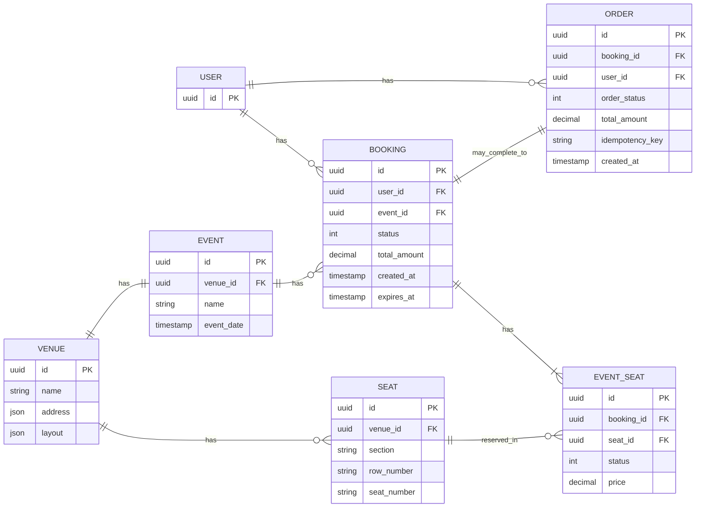
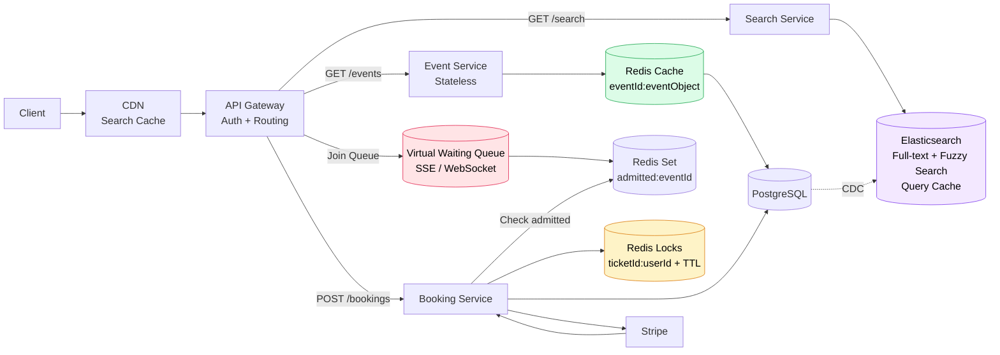

# Техническое решение проекта «Сервис бронирования билетов»

## Введение
Необходимо спроектировать сервис бронирования билетов на мероприятия, который позволяет пользователю выбрать событие, посмотреть доступные места, забронировать билеты и подтвердить покупку.
Система должна поддерживать базовый сценарий:
- пользователь выбирает мероприятие;
- система показывает доступные места;
- пользователь выбирает одно или несколько мест;
- система временно резервирует выбранные места;
- пользователь подтверждает покупку;
- билеты переходят в состояние проданных либо бронь снимается по таймауту или отмене.

Цель проекта — предложить архитектуру highload-системы, способной корректно работать при высокой конкуренции за ограниченный ресурс, предотвращать двойную продажу одного и того же места и выдерживать всплески нагрузки в момент старта продаж.
 

---

## Глоссарий
| Термин        | Определение |
|---------------|-------------|
| Событие | Концерт, спектакль, матч или другое мероприятие, на которое продаются билеты. |
| Место | Конкретная позиция в зале или на площадке, доступная для бронирования. |
| Бронь | Временное резервирование места за пользователем. |
| Покупка | Подтверждённое оформление билета после успешной оплаты. |
| Таймаут брони | Ограниченное время, в течение которого место удерживается за пользователем. |
| Oversell | Cитуация, при которой одно и то же место было продано более одного раза. |
| Idempotency | Возможность безопасно повторить запрос без создания дублей. |
| Статус места | Текущее состояние места: свободно, забронировано, продано. |

---

## Функциональные требования
Система должна предоставлять следующие функции:

1. Просмотр мероприятий
    - Система должна позволять пользователю:
        - просматривать список доступных мероприятий;
        - получать информацию о выбранном мероприятии;
        - видеть схему зала или список мест;
        - видеть текущую доступность мест.

    - Для каждого мероприятия должны быть доступны как минимум:
        - event_id;
        - название;
        - дата и время;
        - место проведения;
        - схема площадки или список мест.

2. Выбор мест
    - Система должна позволять пользователю:
        - выбрать одно или несколько мест;
        - получить информацию о цене выбранных мест;
        - начать процесс бронирования.

3. Временное резервирование мест
    - Система должна:
        - временно резервировать выбранные места за пользователем;
        - назначать время жизни брони;
        - запрещать одновременное успешное резервирование одного и того же места несколькими пользователями;
        - автоматически освобождать места после истечения таймаута, если покупка не была завершена.

4. Подтверждение покупки
    - Система должна позволять пользователю:
        - подтвердить покупку забронированных мест;
        - получить результат операции;
        - после успешного подтверждения перевести места в состояние sold.

5. Отмена брони
    - Система должна поддерживать снятие брони:
        - по явной отмене со стороны пользователя;
        - по истечении таймаута;
        - при неуспешном завершении покупки.

6. История заказов
    - Система должна позволять пользователю:
        - просматривать список своих заказов;
        - видеть статус заказа;
        - получать базовую информацию о мероприятии, местах и стоимости.

---

## Нефункциональные требования
1. Нагрузка
    - Система должна выдерживать:
        - до 1 000 операций бронирования в секунду в пике;
        - до 10 000 запросов в секунду на чтение доступности мест в момент старта продаж.
    - Основной характер нагрузки:
        - чтение доступности мест;
        - короткие конкурентные операции резервирования;
        - резкие всплески нагрузки на популярных событиях.
2. Производительность
    - Требования к производительности:
        - получение списка мест и их доступности — P95 не более 200 мс;
        - создание временной брони — P95 не более 300 мс;
        - подтверждение покупки — P95 не более 500 мс.
3. Надёжность
    - Система должна обеспечивать:
        - отсутствие потери подтверждённых покупок;
        - корректную работу при повторной отправке запросов;
        - устойчивость к сбоям отдельных экземпляров сервисов;
        - автоматическое освобождение “зависших” броней.
4. Консистентность
    - Для критичных операций требуется согласованность:
        - одно место не может быть одновременно успешно забронировано несколькими пользователями;
        - проданное место не может снова стать доступным без отдельной явной операции возврата;
        - подтверждённая покупка не должна приводить к oversell.
    - Для истории заказов допускается eventual consistency.
5. Масштабируемость
    - Система должна горизонтально масштабироваться по следующим контурам:
        - чтение каталога мероприятий;
        - чтение доступности мест;
        - операции бронирования;
        - хранение истории заказов.
---

## Пользовательские сценарии

### Сценарий: просмотр списка мероприятий

1. Пользователь запрашивает список доступных мероприятий. При необходимости пользователь применяет фильтры.
2. Система возвращает отфильтрованный список мероприятий с базовой информацией.

### Сценарий: просмотр деталей мероприятия и схемы зала

1. Пользователь выбирает конкретное мероприятие из списка.
2. Система показывает детальную информацию, включая схему зала с отображением статусов мест.

### Сценарий: выбор свободных мест для бронирования

1. Пользователь на схеме зала выбирает одно или несколько свободных мест для бронирования, и нажимает кнопку "Забронировать"
2. Система проверяет, что все места ещё свободны и не находятся в активной броне у другого пользователя.
3. Система переводит места в статус «забронировано» и назначает время жизни брони.

### Сценарий: подтверждение покупки

1. Пользователь с активной бронью нажимает «Подтвердить покупку».
2. Клиентское приложение отправляет запрос на подтверждение с `booking_id` и платёжными данными.
3. Система проверяет, что бронь активна.
4. Система переводит места из статуса "забронировано" в статус "продано" и создаёт заказ с информацией о мероприятии и местах.
5. Система отправляет пользователю подтверждение с деталями заказа.

### Сценарий: отмена брони пользователем до оплаты

1. Пользователь нажимает кнопку «Отменить бронь» в интерфейсе активной брони.
2. Система проверяет, что бронь существует и принадлежит этому пользователю.
3. Система переводит места из статуса "забронировано" обратно в статус "свободно".
4. Пользователь видит подтверждение, того что бронь отменена.

### Сценарий: автоматическое снятие брони по таймауту

1. Пользователь зарезервировал места, но не подтвердил покупку в течение заданного времени.
2. Для истёкшей брони система переводит связанные места из статуса из статуса "забронировано" обратно в статус "свободно".
4. Освобождённые места снова становятся видны другим пользователям как доступные.
5. Пользователь при попытке оплатить после таймаута получает ошибку: «Время брони истекло. Пожалуйста, выберите места заново».

### Сценарий: просмотр истории заказов пользователя

1. Пользователь запрашивает историю заказов.
3. Система возвращает список заказов пользователя с краткой информацией по каждому.

### Сценарий: просмотр деталей конкретного заказа

1. Пользователь в истории заказов выбирает конкретный заказ.
2. Система возвращает полную информацию о заказе.

### Дополнительный сценарий: возврат оплаченных билетов

1. Пользователь в истории заказов выбирает оплаченный заказ и нажимает «Вернуть билеты».
2. Система проверяет правила мероприятия (возможен ли возврат, сроки до начала события).
3. Если возврат разрешён, система инициирует возврат средств через платёжный шлюз и переводит места из "продано" в "свободно".
4. Пользователь получает подтверждение о возврате и обновлённый статус заказа.

---

## Модель данных (Data Model)

В основе сервиса бронирования лежит управление состояниями мест и заказов. Ключевое требование — предотвращение double-booking (oversell) при высоком конкурентном доступе. Для этого используется комбинация реляционной БД (PostgreSQL) для гарантий ACID и Redis для распределённых блокировок с автоматическим TTL и кэширования доступности мест.

### Основные сущности (Схема БД)

### Описание сущностей

1. **`EVENT`**: Хранит информацию о мероприятии (название, дата, время). Используется в сценариях просмотра списка мероприятий и деталей схемы зала.

2. **`VENUE`**: Содержит адрес площадки и схему зала (`layout`) в формате JSON. Определяет физическую структуру мест, которые затем копируются в `SEAT` для каждого мероприятия.

3. **`SEAT`**: Представляет конкретное место на конкретное мероприятие. Содержит номер, секцию, цену и статус (`free` → `sold`). Статус `reserved` не хранится в БД, так как временная блокировка вынесена в Redis. Статус изменяется при подтверждении покупки или возврате.

4. **`BOOKING`**: Фиксирует временное резервирование мест за пользователем. Содержит статус (`active`, `expired`, `cancelled`, `confirmed`). Создаётся при выборе мест, завершается подтверждением покупки или отменой.

5. **`BOOKING_SEAT`**: Связывает бронь с конкретными местами. Позволяет одной брони включать несколько мест.

6. **`ORDER`**: Создаётся после успешного подтверждения покупки. Хранит итоговую сумму, статус заказа (`paid`, `refunded`, `failed`) и `idempotency_key` для предотвращения дублирования при повторных запросах.

7. **`USER`**: Хранит идентификатор пользователя для привязки броней и заказов.

### Распределённая блокировка Redis (TTL)

Для предотвращения двойного бронирования одного места используется **Redis с атомарной операцией SET NX EX**.

*   **Механизм блокировки**: При выборе места выполняется `SET seat:lock:{event_id}:{seat_id} user_id NX EX 600`. Ключ устанавливается только если отсутствует (NX) и автоматически истекает через 600 секунд (EX). Значение — идентификатор пользователя.

*   **Снятие блокировки**: При успешной оплате `Booking Service` выполняет `DEL`. При отмене пользователем — `DEL`. При истечении TTL — Redis удаляет ключ автоматически, освобождая место без фоновых процессов.

*   **Бронирование нескольких мест**: Блокировки получаются последовательно для каждого места. Если хотя бы одна не удалась — все уже полученные освобождаются (`DEL`), операция полностью отменяется.

### Кэширование доступности мест (Redis Bitmap)

Для достижения 10 000 RPS на чтение доступности мест используется **Redis с Bitmap**.

*   **Структура хранения**: Ключ `event:availability:{event_id}` содержит Bitmap, где каждый бит соответствует одному месту. Значение `1` — свободно, `0` — продано/забронировано. Размер для 50 000 мест — 6.25 KB.

*   **Стратегия чтения**: `Availability Service` при запросе схемы зала выполняет `GET` из Redis Replica. При промахе кэша — загружает статусы из PostgreSQL и записывает в Redis. Это полностью разгружает БД в пик чтения.

*   **Стратегия обновления**: `Booking Service` при успешном бронировании/продаже выполняет `SETBIT` в Redis Master, меняя бит с 1 на 0. Изменения синхронно реплицируются на Redis Replica.

*   **Консистентность**: Допускается асинхронная задержка между мастером и репликой (eventual consistency). В худшем случае пользователь увидит место свободным на 1-2 секунды дольше, но двойная продажа исключена блокировкой.

### Идемпотентность (Idempotency)

Для защиты от двойного списания при повторных запросах используется **уникальный ключ идемпотентности**.

*   **Генерация ключа**: Клиент генерирует `idempotency_key` (UUID v4 или `user_id:request_timestamp`) и передаёт его в запросе на подтверждение покупки.

*   **Уникальное ограничение**: В таблице `ORDER` создаётся уникальный индекс по полю `idempotency_key`. При попытке повторной вставки с тем же ключом БД вернёт ошибку дубликата.

*   **Логика обработки**: При первом запросе создаётся заказ. При повторном — система возвращает ранее созданный заказ (без повторной оплаты и обновления статусов мест).

---

# Архитектура системы

Архитектура построена на микросервисах с использованием Redis для распределённых блокировок с TTL и кэширования доступности. Ключевые требования: выдерживать 10 000 RPS на чтение доступности и 1 000 операций бронирования в секунду в пике.

### Основные компоненты

1. **Load Balancer** — балансировщик нагрузки (Nginx / HAProxy / AWS ALB). Распределяет входящий трафик между экземплярами API Gateway. Обеспечивает health checks и отказоустойчивость.

2. **API Gateway** — горизонтально масштабируемый компонент (3+ экземпляров). Обеспечивает аутентификацию, rate limiting (защита от DDoS) и роутинг запросов к соответствующим сервисам. Масштабируется под нагрузку за счёт добавления новых экземпляров.

3. **Event Service** — сервис для работы с мероприятиями. Отдаёт список мероприятий, детальную информацию и схему зала. Работает в режиме только чтения.

4. **Availability Service** — сервис доступности мест. Обрабатывает до 10 000 RPS запросов на чтение схемы зала со статусами мест. Читает данные из Redis Cache (Bitmap), не нагружая PostgreSQL.

5. **Booking Service** — основной сервис для бронирования и подтверждения покупки. Управляет распределёнными блокировками в Redis, обновляет кэш доступности, создаёт брони и заказы в PostgreSQL, взаимодействует с платёжным шлюзом.

6. **Payment Adapter** — интеграционный сервис для работы с внешним платёжным провайдером. Принимает вебхуки, нормализует их и передаёт в Booking Service.

7. **Order History Service** — сервис истории заказов. Отдаёт пользователю список его заказов и детали.

8. **PostgreSQL Cluster** — основное хранилище данных с ACID-гарантиями. Хранит события (`EVENT`), места (`SEAT`), брони (`BOOKING`) и заказы (`ORDER`).

9. **Redis Cluster** — используется для трёх целей:
   - Распределённые блокировки (TTL) — временное резервирование мест
   - Кэш доступности — Bitmap статусов мест для высоконагруженного чтения
   - Репликация — мастер для записи, реплики для чтения Availability Service

### Архитектурная схема

### Паттерны и подходы

#### Распределённая блокировка Redis (SET NX EX)

Для предотвращения двойного бронирования одного места несколькими пользователями используется паттерн **Распределённая блокировка** на основе Redis. `Booking Service` при выборе мест выполняет атомарную команду `SET key seat_id NX EX ttl`, где `key` имеет формат `seat:lock:{event_id}:{seat_id}`, а значение — `user_id`. Команда атомарна: только один клиент успешно устанавливает ключ для каждого места. TTL (например, 600 секунд) автоматически определяет срок действия блокировки. Это даёт гарантию, что два пользователя не могут одновременно забронировать одно место, и не требует постоянного опроса БД для обработки таймаутов.

#### Кэширование доступности (Bitmap в Redis)

Для достижения 10 000 RPS на чтение доступности мест используется паттерн **Кэширование с Bitmap**. `Availability Service` читает статусы мест напрямую из Redis Replica, где данные хранятся в виде битовой карты (1 бит = место, 1 = свободно, 0 = продано). Это позволяет:
- Уменьшить размер данных: 50 000 мест = 6.25 KB
- Выполнять чтение с производительностью 50 000+ операций/сек на одном узле Redis
- Полностью разгрузить PostgreSQL от пиковых нагрузок чтения

При бронировании `Booking Service` атомарно обновляет кэш через `SETBIT` и реплицирует изменения на Redis Replica, обеспечивая консистентность между чтением и записью.

---

## Технические сценарии

---

## Прочие разделы на ваше усмотрение

## API Методы

### Мероприятия

| Метод | Эндпоинт | Описание |
|-------|----------|----------|
| GET | `/events` | Список доступных мероприятий (с фильтрацией) |
| GET | `/events/{event_id}` | Детальная информация о мероприятии, включая схему мест |

### Бронирование

| Метод | Эндпоинт | Описание |
|-------|----------|----------|
| POST | `/bookings` | Создать временную бронь выбранных мест |
| POST | `/bookings/{booking_id}/deny` | Отменить бронь |
| POST | `/bookings/{booking_id}/confirm` | Подтвердить покупку и завершить заказ |

### Заказы

| Метод | Эндпоинт | Описание |
|-------|----------|----------|
| GET | `/orders` | История заказов пользователя |
| GET | `/orders/{order_id}` | Детальная информация о заказе |

