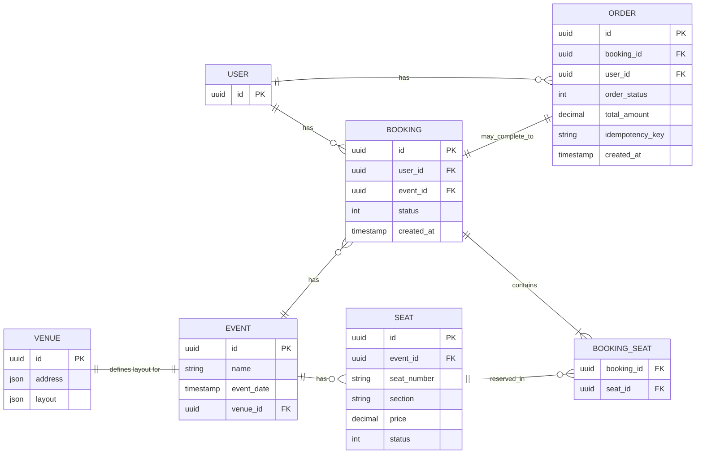
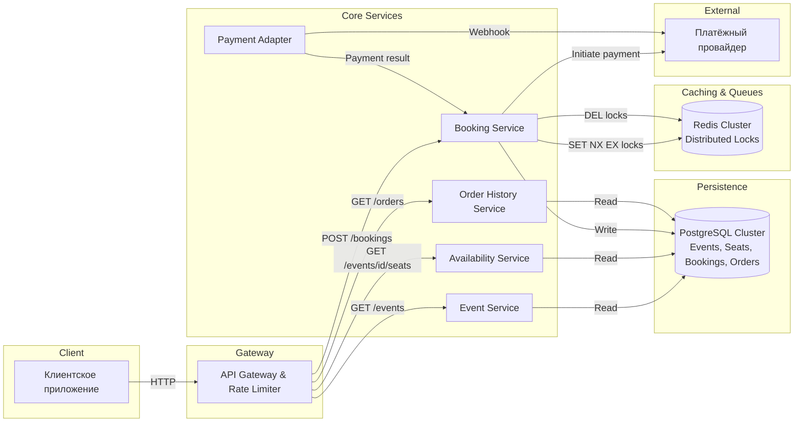

# Техническое решение проекта «Сервис бронирования билетов»

## Введение
Необходимо спроектировать сервис бронирования билетов на мероприятия, который позволяет пользователю выбрать событие, посмотреть доступные места, забронировать билеты и подтвердить покупку.
Система должна поддерживать базовый сценарий:
- пользователь выбирает мероприятие;
- система показывает доступные места;
- пользователь выбирает одно или несколько мест;
- система временно резервирует выбранные места;
- пользователь подтверждает покупку;
- билеты переходят в состояние проданных либо бронь снимается по таймауту или отмене.

Цель проекта — предложить архитектуру highload-системы, способной корректно работать при высокой конкуренции за ограниченный ресурс, предотвращать двойную продажу одного и того же места и выдерживать всплески нагрузки в момент старта продаж.
 

---

## Глоссарий
| Термин        | Определение |
|---------------|-------------|
| Событие | Концерт, спектакль, матч или другое мероприятие, на которое продаются билеты. |
| Место | Конкретная позиция в зале или на площадке, доступная для бронирования. |
| Бронь | Временное резервирование места за пользователем. |
| Покупка | Подтверждённое оформление билета после успешной оплаты. |
| Таймаут брони | Ограниченное время, в течение которого место удерживается за пользователем. |
| Oversell | Cитуация, при которой одно и то же место было продано более одного раза. |
| Idempotency | Возможность безопасно повторить запрос без создания дублей. |
| Статус места | Текущее состояние места: свободно, забронировано, продано. |

---

## Функциональные требования
Система должна предоставлять следующие функции:

1. Просмотр мероприятий
    - Система должна позволять пользователю:
        - просматривать список доступных мероприятий;
        - получать информацию о выбранном мероприятии;
        - видеть схему зала или список мест;
        - видеть текущую доступность мест.

    - Для каждого мероприятия должны быть доступны как минимум:
        - event_id;
        - название;
        - дата и время;
        - место проведения;
        - схема площадки или список мест.

2. Выбор мест
    - Система должна позволять пользователю:
        - выбрать одно или несколько мест;
        - получить информацию о цене выбранных мест;
        - начать процесс бронирования.

3. Временное резервирование мест
    - Система должна:
        - временно резервировать выбранные места за пользователем;
        - назначать время жизни брони;
        - запрещать одновременное успешное резервирование одного и того же места несколькими пользователями;
        - автоматически освобождать места после истечения таймаута, если покупка не была завершена.

4. Подтверждение покупки
    - Система должна позволять пользователю:
        - подтвердить покупку забронированных мест;
        - получить результат операции;
        - после успешного подтверждения перевести места в состояние sold.

5. Отмена брони
    - Система должна поддерживать снятие брони:
        - по явной отмене со стороны пользователя;
        - по истечении таймаута;
        - при неуспешном завершении покупки.

6. История заказов
    - Система должна позволять пользователю:
        - просматривать список своих заказов;
        - видеть статус заказа;
        - получать базовую информацию о мероприятии, местах и стоимости.

---

## Нефункциональные требования
1. Нагрузка
    - Система должна выдерживать:
        - до 1 000 операций бронирования в секунду в пике;
        - до 10 000 запросов в секунду на чтение доступности мест в момент старта продаж.
    - Основной характер нагрузки:
        - чтение доступности мест;
        - короткие конкурентные операции резервирования;
        - резкие всплески нагрузки на популярных событиях.
2. Производительность
    - Требования к производительности:
        - получение списка мест и их доступности — P95 не более 200 мс;
        - создание временной брони — P95 не более 300 мс;
        - подтверждение покупки — P95 не более 500 мс.
3. Надёжность
    - Система должна обеспечивать:
        - отсутствие потери подтверждённых покупок;
        - корректную работу при повторной отправке запросов;
        - устойчивость к сбоям отдельных экземпляров сервисов;
        - автоматическое освобождение “зависших” броней.
4. Консистентность
    - Для критичных операций требуется согласованность:
        - одно место не может быть одновременно успешно забронировано несколькими пользователями;
        - проданное место не может снова стать доступным без отдельной явной операции возврата;
        - подтверждённая покупка не должна приводить к oversell.
    - Для истории заказов допускается eventual consistency.
5. Масштабируемость
    - Система должна горизонтально масштабироваться по следующим контурам:
        - чтение каталога мероприятий;
        - чтение доступности мест;
        - операции бронирования;
        - хранение истории заказов.
---

## Пользовательские сценарии

### Сценарий: просмотр списка мероприятий

1. Пользователь запрашивает список доступных мероприятий. При необходимости пользователь применяет фильтры.
2. Система возвращает отфильтрованный список мероприятий с базовой информацией.

### Сценарий: просмотр деталей мероприятия и схемы зала

1. Пользователь выбирает конкретное мероприятие из списка.
2. Система показывает детальную информацию, включая схему зала с отображением статусов мест.

### Сценарий: выбор свободных мест для бронирования

1. Пользователь на схеме зала выбирает одно или несколько свободных мест для бронирования, и нажимает кнопку "Забронировать"
2. Система проверяет, что все места ещё свободны и не находятся в активной броне у другого пользователя.
3. Система переводит места в статус «забронировано» и назначает время жизни брони.

### Сценарий: подтверждение покупки

1. Пользователь с активной бронью нажимает «Подтвердить покупку».
2. Клиентское приложение отправляет запрос на подтверждение с `booking_id` и платёжными данными.
3. Система проверяет, что бронь активна.
4. Система переводит места из статуса "забронировано" в статус "продано" и создаёт заказ с информацией о мероприятии и местах.
5. Система отправляет пользователю подтверждение с деталями заказа.

### Сценарий: отмена брони пользователем до оплаты

1. Пользователь нажимает кнопку «Отменить бронь» в интерфейсе активной брони.
2. Система проверяет, что бронь существует и принадлежит этому пользователю.
3. Система переводит места из статуса "забронировано" обратно в статус "свободно".
4. Пользователь видит подтверждение, того что бронь отменена.

### Сценарий: автоматическое снятие брони по таймауту

1. Пользователь зарезервировал места, но не подтвердил покупку в течение заданного времени.
2. Для истёкшей брони система переводит связанные места из статуса из статуса "забронировано" обратно в статус "свободно".
4. Освобождённые места снова становятся видны другим пользователям как доступные.
5. Пользователь при попытке оплатить после таймаута получает ошибку: «Время брони истекло. Пожалуйста, выберите места заново».

### Сценарий: просмотр истории заказов пользователя

1. Пользователь запрашивает историю заказов.
3. Система возвращает список заказов пользователя с краткой информацией по каждому.

### Сценарий: просмотр деталей конкретного заказа

1. Пользователь в истории заказов выбирает конкретный заказ.
2. Система возвращает полную информацию о заказе.

### Дополнительный сценарий: возврат оплаченных билетов

1. Пользователь в истории заказов выбирает оплаченный заказ и нажимает «Вернуть билеты».
2. Система проверяет правила мероприятия (возможен ли возврат, сроки до начала события).
3. Если возврат разрешён, система инициирует возврат средств через платёжный шлюз и переводит места из "продано" в "свободно".
4. Пользователь получает подтверждение о возврате и обновлённый статус заказа.

---

## Модель данных (Data Model)

В основе сервиса бронирования лежит управление состояниями мест и заказов. Ключевое требование — предотвращение double-booking (oversell) при высоком конкурентном доступе. Для этого используется комбинация реляционной БД (PostgreSQL) для гарантий ACID и Redis для распределённых блокировок с автоматическим TTL.

### Основные сущности (Схема БД)

### Описание сущностей

1. **`EVENT`**: Хранит информацию о мероприятии (название, дата, время). Используется в сценариях просмотра списка мероприятий и деталей схемы зала.

2. **`VENUE`**: Содержит адрес площадки и схему зала (`layout`) в формате JSON. Определяет физическую структуру мест, которые затем копируются в `SEAT` для каждого мероприятия.

3. **`SEAT`**: Представляет конкретное место на конкретное мероприятие. Содержит номер, секцию, цену и статус (`free` → `sold`). Статус `reserved` не хранится в БД, так как временная блокировка вынесена в Redis. Статус изменяется при подтверждении покупки или возврате.

4. **`BOOKING`**: Фиксирует временное резервирование мест за пользователем. Содержит статус (`active`, `expired`, `cancelled`, `confirmed`). Создаётся при выборе мест, завершается подтверждением покупки или отменой.

5. **`BOOKING_SEAT`**: Связывает бронь с конкретными местами. Позволяет одной брони включать несколько мест.

6. **`ORDER`**: Создаётся после успешного подтверждения покупки. Хранит итоговую сумму, статус заказа (`paid`, `refunded`, `failed`) и `idempotency_key` для предотвращения дублирования при повторных запросах.

7. **`USER`**: Хранит идентификатор пользователя для привязки броней и заказов.

### Redis для временного резервирования (блокировки с TTL)

Временная блокировка мест вынесена из PostgreSQL в Redis. Это позволяет:
- Автоматически освобождать места по таймауту без фоновых процессов
- Получать и снимать блокировки с высокой скоростью (in-memory)
- Избежать состояния гонки благодаря атомарной операции Redis

**Схема работы с Redis:**

| Операция | Действие |
|----------|----------|
| **Бронирование мест** | Выполняется атомарная `SET key seat_id NX EX ttl`. Значение — `user_id`. Только один клиент успешно устанавливает ключ для каждого места. |
| **Подтверждение покупки** | Перед обновлением БД проверяется, что ключ в Redis принадлежит этому пользователю. После успешного обновления БД ключ удаляется (`DEL`). |
| **Таймаут** | Redis автоматически удаляет ключ по истечении TTL. Место становится доступным без участия приложения. |
| **Отмена брони** | Ключ удаляется из Redis вручную, места освобождаются мгновенно. |

### Идемпотентность (Idempotency)

Для корректной обработки повторных запросов используется механизм идемпотентности.

**Реализация:**
- Клиент генерирует уникальный `idempotency_key` (например, UUID v4 или `user_id:request_timestamp`)
- Ключ передаётся в запросе на подтверждение покупки
- В таблице `ORDER` создаётся уникальное ограничение по полю `idempotency_key`

---

## Архитектура системы

Архитектура построена на микросервисах с использованием Redis для распределённых блокировок с TTL. Ключевые требования: выдерживать 10 000 RPS на чтение доступности и 1 000 операций бронирования в секунду в пике.

### Основные компоненты

1. **API Gateway** — входная точка для клиентов. Обеспечивает аутентификацию, rate limiting (защита от DDoS) и роутинг запросов к соответствующим сервисам.

2. **Event Service** — сервис для работы с мероприятиями. Отдаёт список мероприятий, детальную информацию и схему зала. Работает в режиме только чтения.

3. **Availability Service** — сервис доступности мест. Обрабатывает до 10 000 RPS запросов на чтение схемы зала со статусами мест. Читает данные из PostgreSQL, используя индексы и кэширование на уровне БД.

4. **Booking Service** — основной сервис для бронирования и подтверждения покупки. Управляет распределёнными блокировками в Redis, создаёт брони и заказы в PostgreSQL, взаимодействует с платёжным шлюзом.

5. **Payment Adapter** — интеграционный сервис для работы с внешним платёжным провайдером. Принимает вебхуки, нормализует их и передаёт в Booking Service.

6. **Order History Service** — сервис истории заказов. Отдаёт пользователю список его заказов и детали.

7. **PostgreSQL Cluster** — основное хранилище данных с ACID-гарантиями. Хранит события (`EVENT`), места (`SEAT`), брони (`BOOKING`) и заказы (`ORDER`).

8. **Redis Cluster** — используется для распределённых блокировок с TTL при временном резервировании мест.

### Архитектурная схема

### Паттерны и подходы

#### Распределённая блокировка Redis (SET NX EX)

Для предотвращения двойного бронирования одного места несколькими пользователями используется паттерн **Распределённая блокировка** на основе Redis. `Booking Service` при выборе мест выполняет атомарную команду `SET key seat_id NX EX ttl`, где `key` имеет формат `seat:lock:{event_id}:{seat_id}`, а значение — `user_id`. Команда атомарна: только один клиент успешно устанавливает ключ для каждого места. TTL (например, 600 секунд) автоматически определяет срок действия блокировки. Это даёт гарантию, что два пользователя не могут одновременно забронировать одно место, и не требует постоянного опроса БД для обработки таймаутов.

---

## Технические сценарии

---

## Прочие разделы на ваше усмотрение
